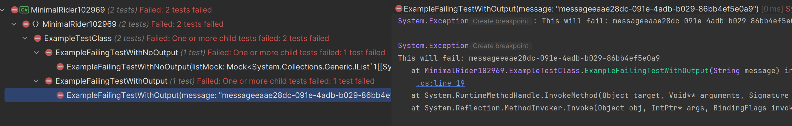

# Minimal project for RIDER-102969
I have recreated a minimal working example that will always fail to display the test output properly in Rider 2023.3.

Sadly this is stopping our team from upgrading to dotnet 8 :(

## Problem
The problem seems to stem from when we use the `AutoFixture` nuget package along with `AutoFixture.AutoMoq`.

I am not sure why exactly, but it seems to consistently fail with Rider 2023.3.

## Images
### Rider 2023.2.3
With mock injection, the output displays correct.

Without mock injection, the output also displays correct.

## Images
### Rider 2023.3
With mock injection, the output does **NOT** displays correct.

Without mock injection, the output **DOES** displays correct.
